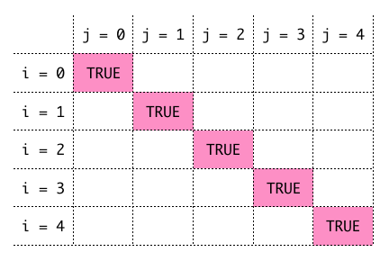
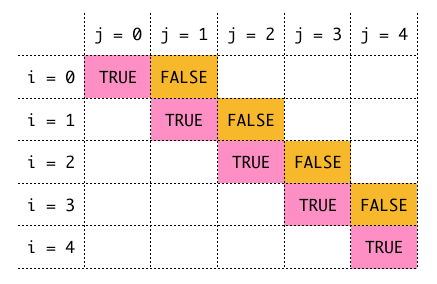
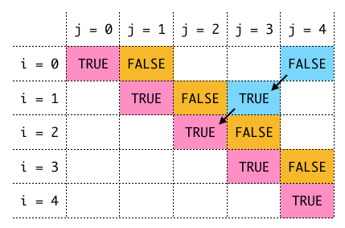
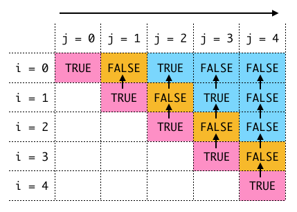

## LeetCode.5 最长回文子串

> 给定一个字符串 s，找到 s 中最长的回文子串。你可以假设 s 的最大长度为 1000。
>
> 示例 1:
```
输入: "babad"
输出: "bab"
注意: "aba" 也是一个有效答案。
```
>
> 示例 2:
```
输入: "cbbd"
输出: "bb"
```

在一个字符串中子串可以由 **`起始下标`** 和 **`终止下标`** 表示,
例如 **`"aba"`** 在 **`"babad"`** 中的起始下标为 1 终止下标为 3.<br>
对于 **`回文串`** 它的 **`起始下标`** 和 **`终止下标`** 的字符是一样的, 并且 **`起始下标`** 和 **`终止下标`** 之间也是回文子串.<br>

建立 **`二维数组(dp)`**:<br>
**`dp[i][j]`** 表示当 **`当起始下标为 i`** 并且当 **`当终止下标为 j`** 时该子串是否为回文子串.<br>

1. 如果 **`i 等于 j (单个字符)`** 很明显这是回文子串, **`dp[i][j] = True`**
2. 如果 **`i 等于 j - 1 (连续两个字符)`** 如果 **`s[i] 等于 s[j]`** 则 **`dp[i][j] = True`** 否则 **`dp[i][j] = False`**
3. 对于其他情况, ** 如果 **`s[i] 不等于 s[j]`** 则 **`dp[i][j] = False`** 否则 **`dp[i][j] = dp[i + 1][j - 1]`**

如果某项 **`dp[i][j] == True`** 则子串长度为 **`j - i + 1`**, 子串为 **`s[i:j + 1]`.**<br>
记录最长子串长度的子串, 然后返回即可.

**`数组遍历顺序:`**<br>

根据示例1: <br>

首先单个字符都是回文子串:

{:.dp-matrix1}

其次, 相邻字符可能是也可能不是回文子串:

{:.dp-matrix2}

最后, 其它数组中的状态依赖于它左下的状态:

{:.dp-matrix3}

所以数组的遍历次序要保证每个状态的左下的状态会优先判断.<br>
方法是**`终止下标`**依次递增, 但**`起始下标`**从**`终止下标`**开始依次递减到 0.

{:.dp-matrix4}

**`Python代码:`**

```python
class Solution(object):
    def longestPalindrome(self, s):
        """
        :type s: str
        :rtype: str
        """
        s_len = len(s)
        max_len = 0
        max_str = ""
        m = [[False for _ in range(s_len)] for _ in range(s_len)]

        for j in range(s_len):
            for i in range(j, -1, -1):
                sub_len = j - i + 1

                if i == j:
                    m[i][j] = True
                elif j - i == 1:
                    m[i][j] = s[i] == s[j]
                else:
                    m[i][j] = s[i] == s[j] and m[i + 1][j - 1]

                if m[i][j] and sub_len > max_len:
                    max_len = sub_len
                    max_str = s[i:j + 1]
        return max_str
```
