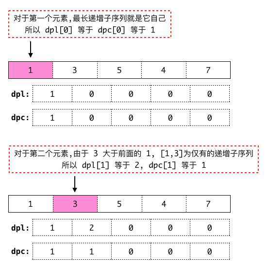
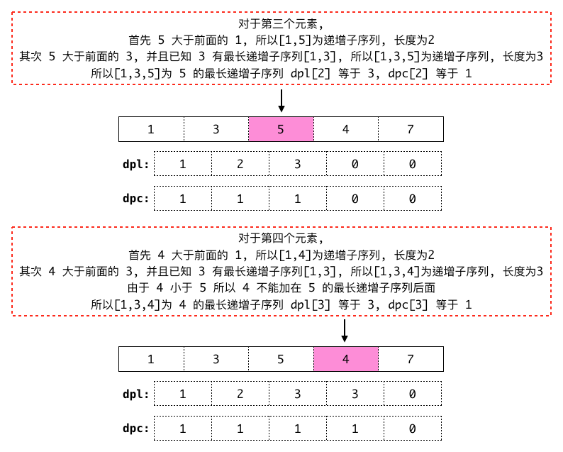
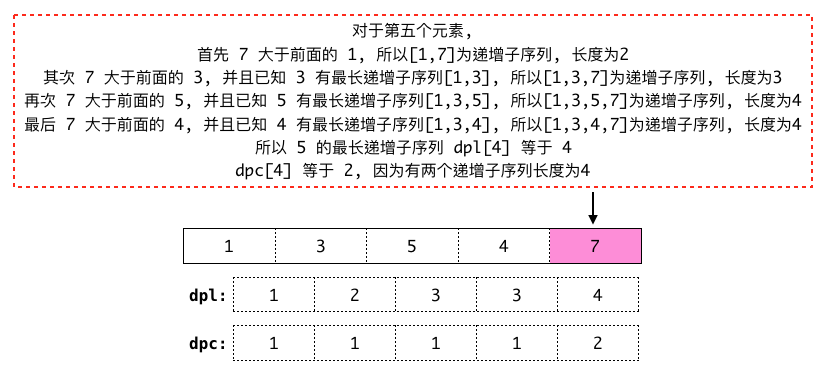

## LeetCode.673 最长递增子序列的个数

> 给定一个未排序的整数数组，找到最长递增子序列的个数。
>
> 示例 1:
```
输入: [1,3,5,4,7]
输出: 2
解释: 有两个最长递增子序列，分别是
    [1, 3, 4, 7] 和
    [1, 3, 5, 7]。
```
>
> 示例 2:
```
输入: [2,2,2,2,2]
输出: 5
解释: 最长递增子序列的长度是1，并且存在5个子序列的长度为1，因此输出5。
```

建立 **`两个一维数组(dpl, dpc)`**<br>
**`dpl[i]`** 表示当 **`数组`** 遍历到第 **`i + 1`** 个元素时最长递增子序列的 **`长度`**.<br>
**`dpc[i]`** 表示当 **`数组`** 遍历到第 **`i + 1`** 个元素时最长递增子序列的 **`个数`**.<br>
也就是 **`dpl[0]`** 和 **`dpc[0]`** 分别表示遍历到第 **`1`** 个元素时最长递增子序列的 **`长度`** 和 **`个数`**.<br>
很明显 **`dpl[0] 等于 dpc[0] 等于 1`**<br><br>
根据示例1:

{:.dp-matrix}

{:.dp-matrix}

{:.dp-matrix}

由此可知 **`状态转移算法`** 为:<br>

对于每一个元素默认它的最长递增子序列的 **`长度`** 和 **`个数`** 都为 **`1`**.
然后遍历它前面的所有元素, 例如:

```python
# 获取数组长度
n_len = len(nums)

for i in range(n_len):
    # 默认最长递增子序列的 长度 和 个数 都为 1
    dpc[i] = dpl[i] = 1
    for j in range(i):
        # ...
```

如果 **`nums[i]`** 小于等于 **`nums[j]`** 则不做任何处理, 因为 **`nums[i]`** 无法使序列递增.<br>
否则:
1. 如果 "**`nums[i]`** 的长度 **`dpl[i]`**" **`小于`** "**`nums[j]`** 的长度 **`dpl[j]`**" 加一, 则意味着 **`nums[i]`** 拥有更长的递增子序列,
长度为 **`dpl[j] + 1`**, 个数为 **`dpc[j]`** (个数不变, 因为只是延长了 **`nums[j]`** 的每一个最长递增子序列).
2. 如果 "**`nums[i]`** 的长度 **`dpl[i]`**" **`等于`** "**`nums[j]`** 的长度 **`dpl[j]`**" 加一, 则意味着 **`nums[i]`** 有相同长度的递增子序列出现,
长度 **`不变`**, 个数为当前个数累加 **`dpc[j]`**.

上述计算完成之后在 **`dpl数组`** 中查找最大值, 最大值即为 **`最长递增子序列的长度`**.<br>
然后在 **`dpc数组`** 中把最大值对应的个数求和, 求到的总数即为 **`最长递增子序列的个数`**.

**`Python代码:`**

```python
class Solution(object):
    def findNumberOfLIS(self, nums):
        """
        :type nums: List[int]
        :rtype: int
        """
        if not nums:
            return 0

        n_len = len(nums)
        dpc = [0] * n_len
        dpl = [0] * n_len
        for i in range(n_len):
            dpc[i] = dpl[i] = 1

            for j in range(i):
                if nums[i] <= nums[j]:
                    continue

                if dpl[i] < dpl[j] + 1:
                    dpl[i] = dpl[j] + 1
                    dpc[i] = dpc[j]
                elif dpl[i] == dpl[j] + 1:
                    dpc[i] += dpc[j]

        max_len = max(dpl)
        max_count = 0
        for i in range(n_len):
            if dpl[i] == max_len:
                max_count += dpc[i]
        return max_count
```
