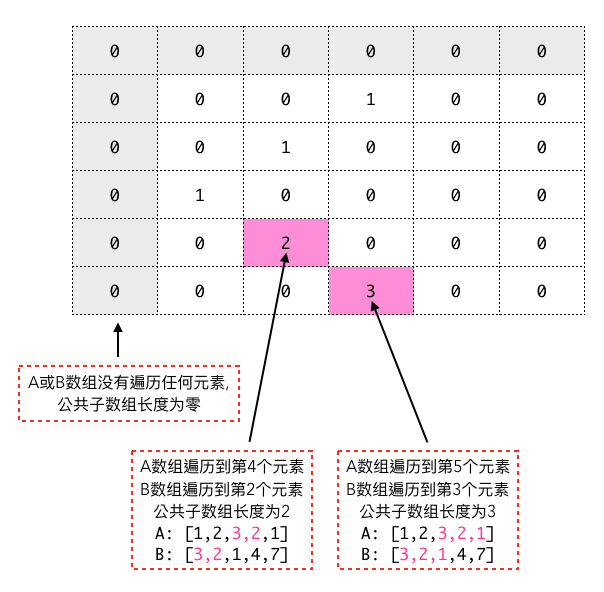

## LeetCode.718 最长重复子数组

> 给两个整数数组 A 和 B ，返回两个数组中公共的、长度最长的子数组的长度。
>
> 示例 :
```
输入:
A: [1,2,3,2,1]
B: [3,2,1,4,7]
输出: 3
解释:
长度最长的公共子数组是 [3, 2, 1]。
```

建立 **`二维数组(dp)`**<br>
**`dp[i][j]`** 表示当 **`A数组`** 遍历到第 **`i`** 个元素, 并且当 **`B数组`** 遍历到第 **`j`** 个元素, 公共子数组的长度。

{:.dp-matrix}
